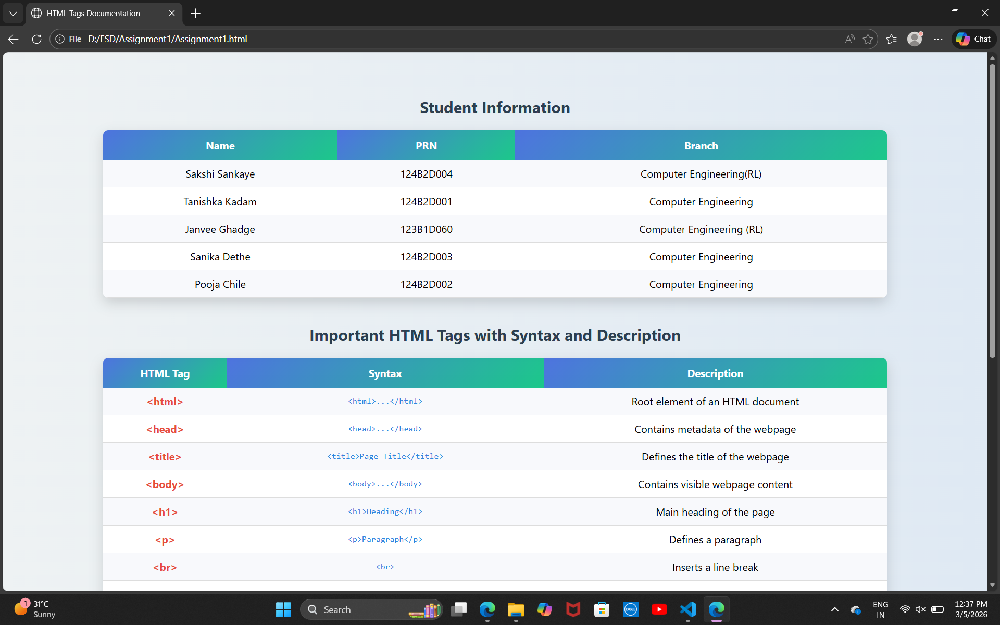
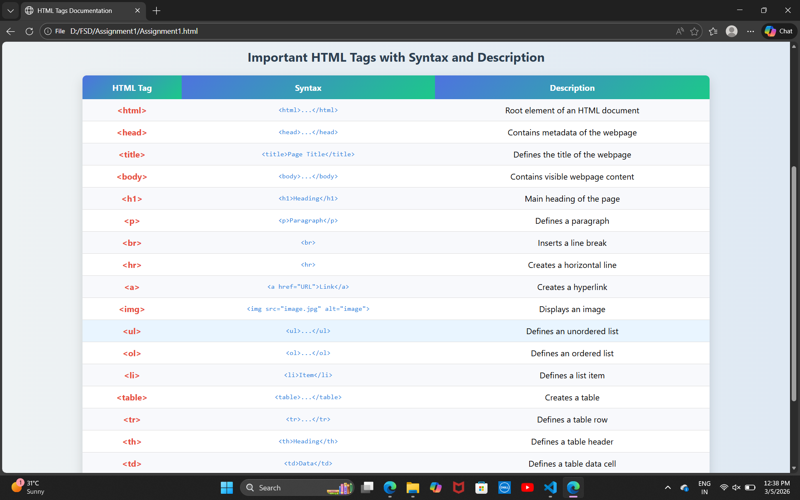

# Assignment 1: HTML Tags Table

## Problem Statement
Create an HTML webpage that displays commonly used HTML tags along with their syntax and description in a structured table format.

## Objective
- To understand the basic structure of an HTML document.
- To learn commonly used HTML tags.
- To display data in a tabular format using HTML tables.
- To practice basic CSS styling for better presentation.

## Technologies Used
- HTML
- CSS

## Description
This assignment demonstrates the usage of basic HTML tags by presenting them in a table format. Each row of the table contains the tag name, its syntax, and a brief description explaining its purpose.

The webpage is designed using HTML for structure and CSS for styling to improve readability and visual appearance.

## Features
- Displays commonly used HTML tags in a structured table format.
- Includes tag name, syntax, and description.
- Uses CSS styling for better table layout and readability.
- Simple and easy-to-understand webpage structure.

## Folder Structure
    Ass1
    ├── Assignment No1.html
    └── Outputs
        ├── Output1.png
        └── Output2.png
    └──README.md

## Output

### Output 1

### Output 2

## Conclusion
This assignment helped in understanding the fundamentals of HTML and how different HTML tags are used to structure content on a webpage. It also provided practice in organizing information using tables and applying basic CSS styling.