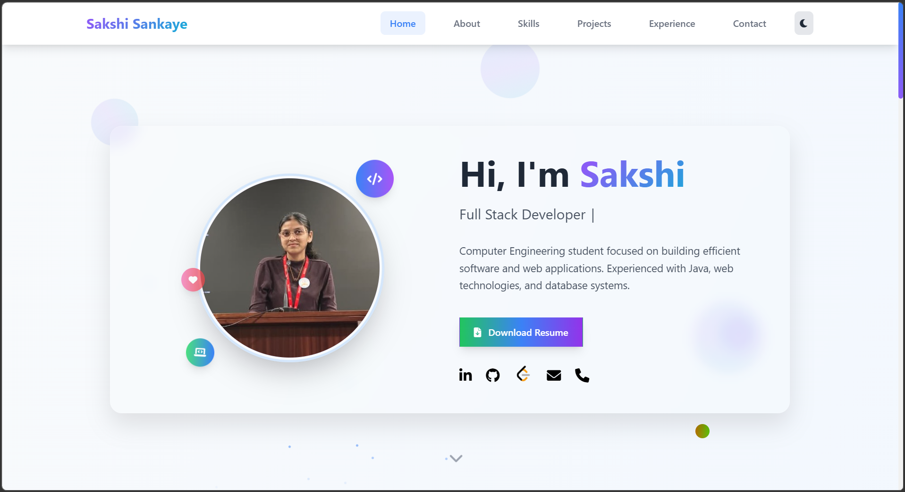
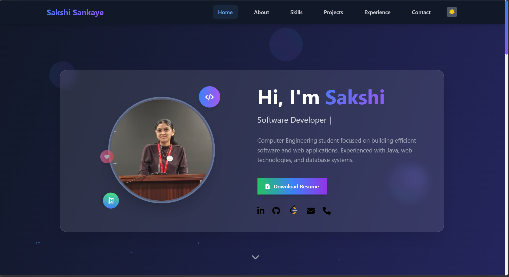
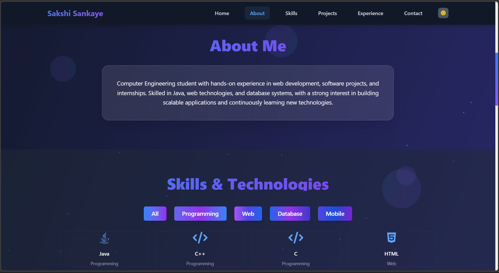
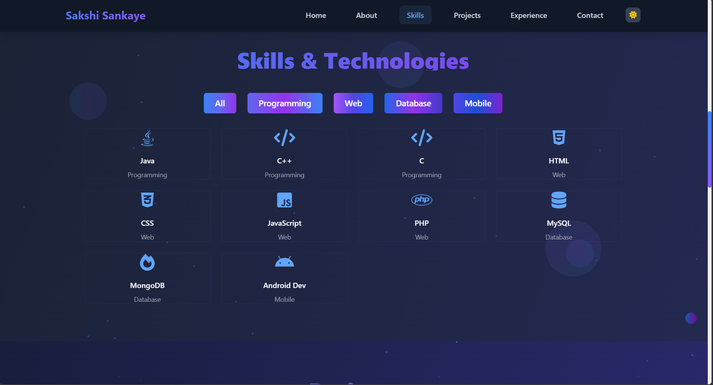
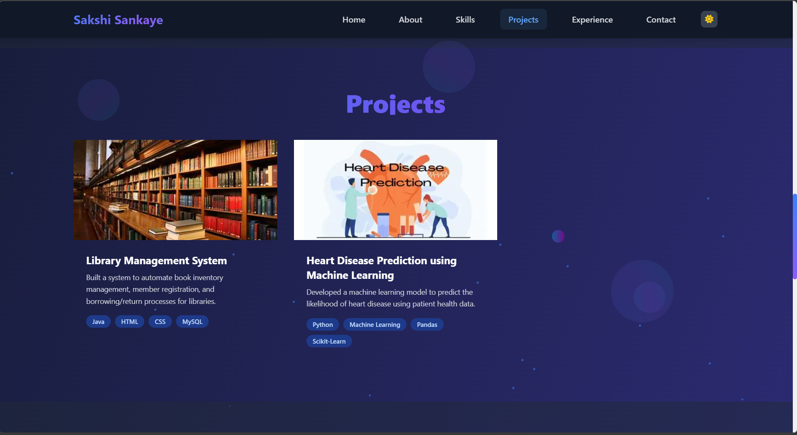
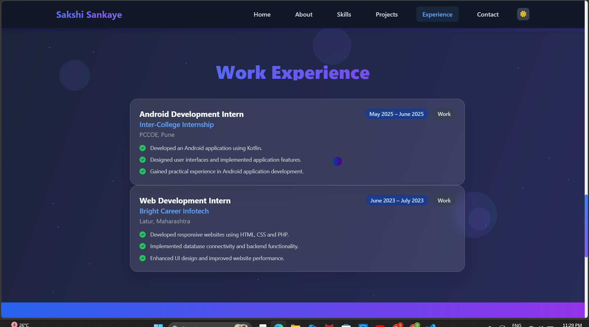
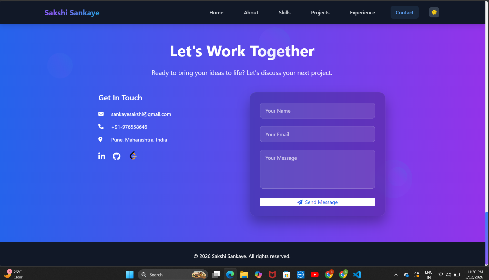

# Assignment 2: Personal Portfolio Website

## 📌 Problem Statement
Design and develop a personal portfolio website that presents personal details, skills, projects, and contact information in an organized and visually appealing manner.

---

## 🎯 Objective
- To design a personal portfolio webpage using HTML and CSS.
- To practice webpage layout and styling techniques.
- To present personal information and projects in a structured format.

---

## 🛠️ Technologies Used
- HTML
- CSS
- JavaScript

---

## 📖 Description
This project is a personal portfolio website that showcases an individual's profile, skills, projects, and contact details.

The webpage is structured using HTML and styled using CSS to create a clean and visually appealing layout. JavaScript is used to add basic interactivity.

---

## ✨ Features
- Displays personal profile information
- Includes sections for skills, projects, and contact details
- Resume included in the project
- Clean and simple webpage layout
- Styled using CSS for better UI

---

## 📁 Folder Structure

Assignment 2  
│  
├── Outputs  
│   ├── output 1.png  
│   ├── output 2.png  
│   ├── output 3.png  
│   ├── output 4.png  
│   ├── output 5.png  
│   ├── output 6.png  
│   ├── output 7.png  
│  
├── portfolio-main  
│   ├── .vscode  
│   ├── Sakshi_Sankaye.pdf  
│   ├── blue-line-flat-circle-portfolio-....  
│   ├── brightinfotech.jpeg  
│   ├── heart.jpeg  
│   ├── index.html  
│   ├── internslite.png  
│   ├── jscoverphoto.jpg  
│   ├── library.jpeg  
│   ├── profile.jpg.jpeg  
│   ├── script.js  
│   ├── styles.css  
│  
└── README.md  

---

## 📸 Output

### Output 1

### Output 2

### Output 3

### Output 4

### Output 5

### Output 6

### Output 7

---

## ✅ Conclusion
This assignment helped in understanding how to design and develop a personal portfolio website using HTML and CSS. It also provided experience in structuring content and applying styling to improve the overall presentation of a webpage.
